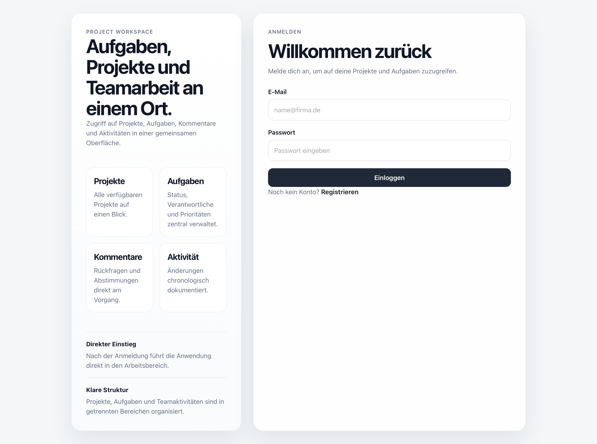
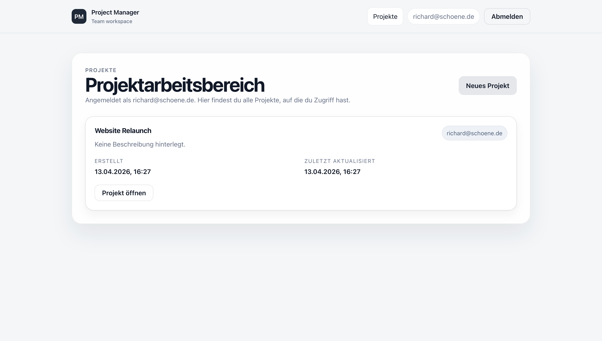
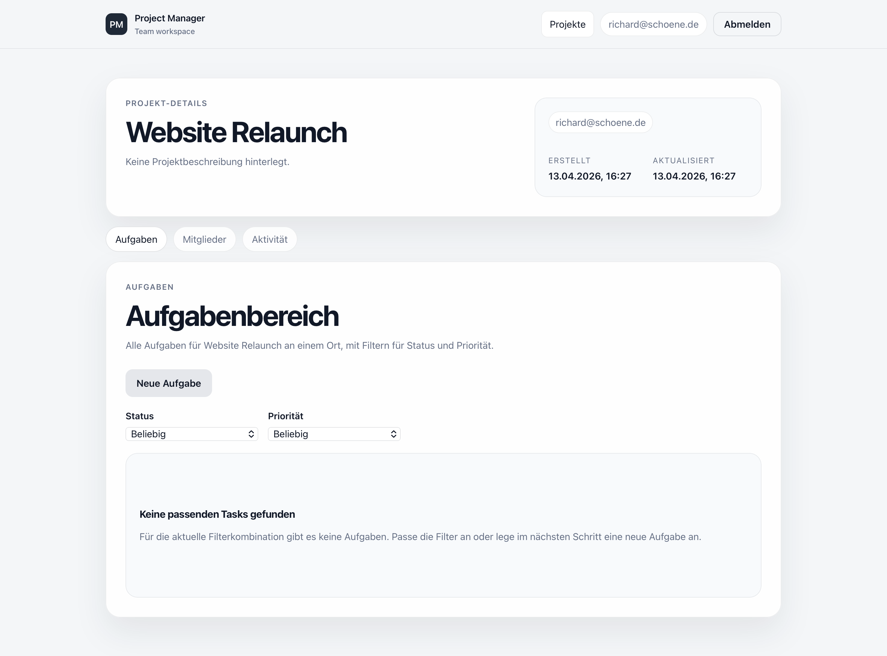

# Project Manager Frontend

A modern project management frontend built with React, TypeScript, and Vite. It provides a focused workspace for teams to manage projects, tasks, members, comments, and activity through a clean interface connected to a Spring Boot backend.

## ✨ Features

- Secure authentication flow with login, registration, and session persistence
- Project overview with direct access to active workspaces
- Detailed project view with dedicated sections for tasks, members, and activity
- Task management with creation, editing, filtering, status updates, and assignment
- Member management with project-based access handling
- Comment workflows for collaborative task discussions
- Activity tracking for better visibility into project changes
- Loading, error, and empty states for a more polished user experience

## 📸 Screenshots

### Login



### Projects Overview



### Project Details



## 🛠 Tech Stack

**Frontend**
- React
- TypeScript
- Vite
- React Router

**Backend Integration**
- Spring Boot REST API
- JWT-based authentication
- OpenAPI-generated API types

## 🧱 Architecture

The application is structured around a clear separation of concerns:

- **Routing:** handled with React Router for public and protected application areas
- **Authentication:** centralized auth state with guarded routes and session bootstrap
- **API Layer:** reusable request helpers and typed service modules for backend communication
- **Feature-Based UI:** pages and components organized by domain, such as auth, projects, and tasks

## 🔌 Backend Integration

The frontend communicates with a Spring Boot backend via REST endpoints.

- API base URL is configured through `VITE_API_URL`
- If no environment variable is set, the app falls back to `http://localhost:8080`
- Authentication is based on JWT tokens
- After login or registration, the token is stored client-side and sent in the `Authorization` header for protected requests

Example:

```bash
VITE_API_URL=http://localhost:8080
```

## 🚀 Getting Started

1. Clone the repository
2. Install dependencies
3. Configure the backend API URL if needed
4. Start the development server

```bash
npm install
npm run dev
```

To create a production build:

```bash
npm run build
```

To run linting:

```bash
npm run lint
```

## 📂 Project Structure

```bash
src/
├── api/         # API client and backend service modules
├── components/  # Reusable UI building blocks
├── features/    # Domain-specific logic such as authentication
├── hooks/       # Shared React hooks
├── layouts/     # App shell and auth layouts
├── pages/       # Route-level screens
├── types/       # API and UI types
└── utils/       # Shared utilities
```
